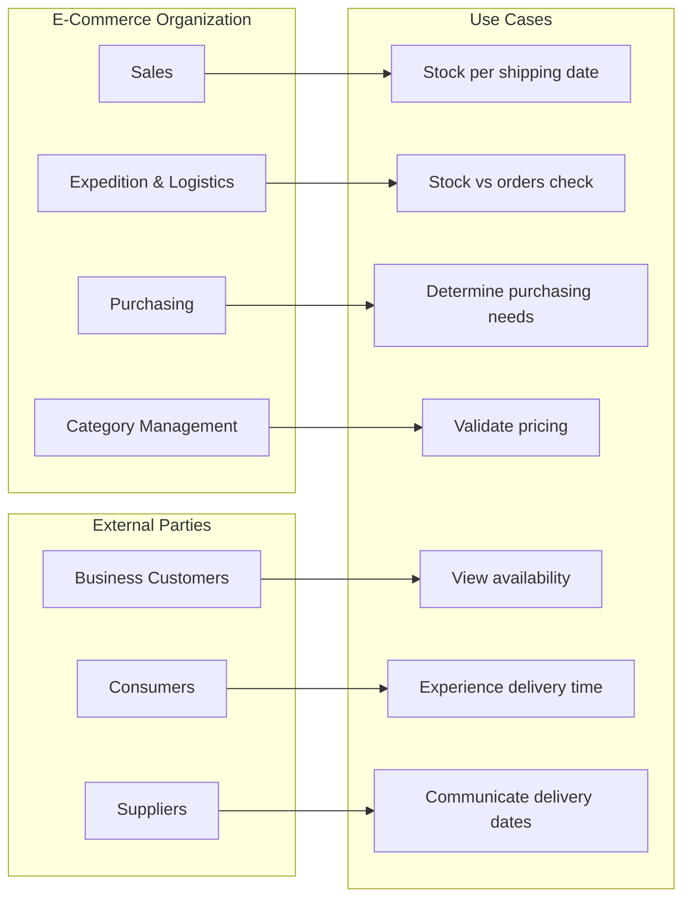

Currently, there is a lot of discussion about building software with AI. This changes the dynamics within development teams and therefore also the dynamics between the product owner and the developers. To gain experience and have a good time at the same time, I will specify a back-end application in the upcoming articles with the help of AI. The focus here is on developing a specification that is independent of the technology and aligns as well as possible with the coding process with AI. The focus of these articles is therefore on the relationship between the product owner and the development team, not between the product owner and external stakeholders.

I will use Claude Code for both the specification and the coding. By staying close to the AI and not using AI tools like NotebookLM as much, I learn the most and better understand how we reached the result.

## Which Application

As an application, I have chosen an available stock calculation platform that I had built for a former client Solarclarity by a team at Enrise. The focus here is on the back-end that must calculate the actual available stock. I will apply some simplifications to limit the scope without shortchanging the experience of working with AI.

### The Vision and User Stories

When customers of a B2B e-commerce company can rely on timely deliveries of orders, they are not only buying products, but also saving the costs of dealing with delivery uncertainty. This saving is threefold:

* Customers don't need to maintain their own inventory, which saves a lot of capital.
* Customers don't need to or only need to build in a limited time margin between the delivery time of the order and the use of that order. Earlier delivery often translates into a competitive advantage. Think of all combinations of products and services such as the delivery and installation of technical systems.
* Customers need to reschedule product deliveries or even service deliveries as little as possible, whereby goodwill, disappointment with end customers, and additional costs such as having to take time off with end customers are eliminated.

The value of clear communication about available stock is therefore a clear added value for both B2B2C and B2C e-commerce organizations.

### The Stakeholders
I have mapped the following stakeholders in the B2B2C scenario:

#### The E-Commerce Organization
The E-commerce organization is represented by many perspectives:

* Sales people are interested in how much of the items can be sold given a certain shipping date to the customer.
* The expedition & logistics department wants to know if the stock is sufficient given the existing sales orders with desired shipping date.
* The purchasing department wants to know if additional items need to be ordered.
* The category management department wants to know if the pricing is correct for the current stock and expected sales.

#### The Business Customers
Business customers want to know when they can order a certain quantity with the highest possible chance of actually receiving goods on the desired delivery date. If they can see the available stock as a function of time at the moment of ordering.

#### The Consumer End Customers
Consumer end customers will experience that promised delivery times are met. If a service needs to be delivered with the products (such as an installation or placement service), it will take place at the promised time and they will rarely have to reschedule. This prevents unnecessary time off from work or other obligations.

#### The Suppliers
The suppliers of the items that the E-commerce organization sells will have a determining influence on the predictability of the delivery of the items. The more accurate and predictable they can predict delivery to the e-commerce organization, the better and faster the deliveries of the e-commerce organization. If the supplier is not accurate in their estimate of delivery time, the e-commerce organization will have to build in a safety margin, which does not benefit the availability time of the items.
Suppliers will need to be able to communicate in a simple automated way about the delivery date of orders with the e-commerce organization.

### The Simplifications
To limit the complexity of the solution, I apply the following simplifications:

* We limit ourselves to a single warehouse. Both the storage of items and order picking and order packing all happen at one location.
* We limit ourselves to an API-only back-end application. Perhaps the front-end for staff or the front-end for customers in the e-commerce webshop is a nice follow-up project.
* We assume that items are durable. Available stock therefore means stock that is free to sell because it will be in stock on time and has not yet been sold to another customer. The quality of the items is therefore considered constant.

## Does this solution already exist?
Many ERP systems with order processing functionalities contain a very simple form of inventory management and calculation of available stock. In the next blog, I will explain how we can improve this simple way of inventory management.
