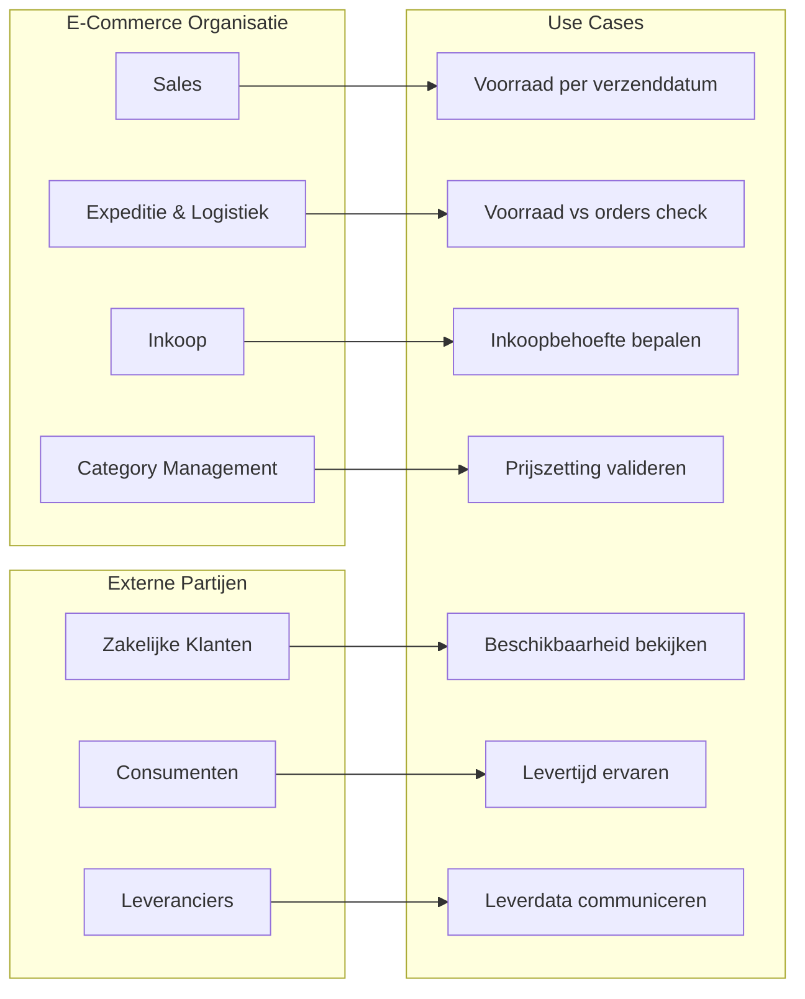

Momenteel wordt er veel gesproken over het bouwen van software met AI. Dit verandert de dynamiek binnen development teams en daarmee ook de dynamiek tussen de product owner en de developers. Om ervaring op te doen en tegelijkertijd een goede tijd te hebben, zal ik in de komende artikelen een back-end applicatie specificeren met behulp van AI. Hierbij ligt de focus op het ontwikkelen van een specificatie die onafhankelijk is van de technologie en zo goed mogelijk aansluit bij het codeerproces met AI. De focus van deze artikelen ligt dus op de relatie van de product owner en het development team en niet tussen de product owner en de externe stakeholders. 

Ik zal gebruik maken van Claude Code voor zowel de specificatie als voor het coderen. Door dicht bij de AI te blijven en niet zoveel gebruik te maken van AI tools zoals bijvoorbeeld NotebookLM, leer ik het meeste en snap ik beter hoe we tot resultaat ben gekomen.

## Welke toepassing

Als toepassing heb ik een verkoopbare voorraad berekeningsplatform gekozen die ik voor een voormalige klant Solarclarity heb laten bouwen door een team van Enrise. Hierbij ligt de focus op de back-end die de daadwerkelijke verkoopbare voorraad moet berekenen. Ik zal wel wat vereenvoudigingen toepassen om de scope wat in te perken zonder dat we de ervaring van het werken met AI te kort doen.

### De Visie en de User Stories

Wanneer klanten van een B2B e-commerce bedrijf kunnen vertrouwen op tijdige leveringen van bestellingen, kopen ze niet alleen producten, maar besparen ze de kosten voor het omgaan met de onderzekerheid van de leveringen. Deze besparing is drievoudig:

* Klanten hoeven zelf geen voorraad aan te houden, wat veel kapitaal bespaart.
* Klanten hoeven geen of maar beperkt een tijdsmarge in te bouwen tussen de levertijd van de bestelling en het gebruik van deze bestelling. Eerder kunnen leveren, vertaalt zich vaak in een concurrentie voorsprong. Denk hierbij aan alle combinaties van producten en services zoals bijvoorbeeld de levering en installatie van technische systemen.
* Klanten hoeven productleveringen of zelfs serviceleveringen zo min mogelijk te herplannen, waarbij goodwill, teleurstelling bij eindklanten en additionele kosten zoals het moeten vrijnemen bij eindklanten weggenomen worden.

De waarde van heldere communicatie over verkoopbare voorraad is dus een duidelijk toegvoegde waarde voor zowel B2B2C als B2C e-commerce organisaties.

### De Stakeholders
De volgende stakeholders heb ik in kaart gebracht in het B2B2C scenario:

#### De E-Commerce Organisatie
De E-commerce organisatie wordt door vele perspectieven vertegenwoordigd:

* Zo zijn de mensen van sales geïnteresseerd in hoeveel er van de artikelen verkocht kunnen worden gegeven een bepaalde verzenddatum naar de klant.
* De afdeling expeditie & logistiek wil weten of de voorraad voldoende is gegeven de bestaande sales orders met gewenste verzenddatum.
* De afdeling inkoop wil weten of er extra artikelen besteld moeten worden.
* De afdeling category management wil weten of de prijszetting correct is voor de hudige voorraad en de verwachte verkopen.

#### De Zakelijke Klanten
De zakelijke klanten willen weten per wanneer zij een bepaalde hoeveelheid kunnen bestellen met een zo hoog mogelijke kans op werkelijke ontvangst van goederen op de gewenste leverdatum. Als zij de verkoopbare voorraad als functie van de tijd kunnen zien op het moment van bestellen

#### De Consumenten Eindklanten
De consumenten eindklanten zullen ervaren dat beloofde levertijden gehaald worden. Mocht er een service geleverd meten worden met de producten (zoals een installatie- of plaatsingsservice) dan zal deze op de beloofde tijd plaatsvinden en zullen ze zelden moeten verplaatsen. Dit voorkomt onnodig vrijvragen van werk of andere verplichtingen.

#### De Leveranciers
De leveranciers van de artikelen die de E-commerce organisatie verkoopt zullen een bepalende invloed hebben op de voorspelbaarheid van de levering van de artikelen. Hoe nauwkeuriger en voorspelbaarder zij de levering aan de e-commerce organisatie kunnen voorspellen, hoe beter en sneller de leveringen van de e-commerce organisatie. Als de leverancier niet nauwkeurig is in zijn inschatting van leveringstijd, dan zal de e-commerce organisatie een veiligheidsmarge moeten inbouwen, wat de tijd van beschikbaarheid van de artikelen niet ten goede komt.
De leveranciers zullen op een eenvoudige wijze geautomatiseerd moeten kunnen communiceren over de leverdatum van de bestellinge met de e-commerce organisatie.

### De Vereenvoudigingen
Om de complexitijd van de oplossing in te perken, pas ik de volgende vereenvoudigingen toe:
* We beperken ons tot een enkel magazijn. Zowel de opslag van artikelen als het orderpicken en het orderverpakken gebeurt allemaal op één locatie.
* We beperken ons tot een API-only back-end applicatie. Wellicht is de front-end voor het personeel, als de front-end voor de klanten in de e-commerce webshop een mooi vervolgproject.
* We gaan ervan uit dat artikelen houdbaar zijn. Met verkoopbare voorraad wordt dus voorraad bedoeld die vrij is om te verkopen omdat deze op tijd op voorraad zal zijn en nog niet aan een andere klant verkocht is. De kwaliteit van de artikelen wordt dus als constant beschouwd.

## Bestaat deze oplossing al?
Veel van de ERP systemen met orderprocessing functionaliteiten bevatten een erg simpele vorm van voorraadbeheer en berekening van verkoopbare voorraad. In de volgende blog zal ik uitleggen hoe we deze eenvoudige manier van voorraadbeheer kunnen verbeteren.